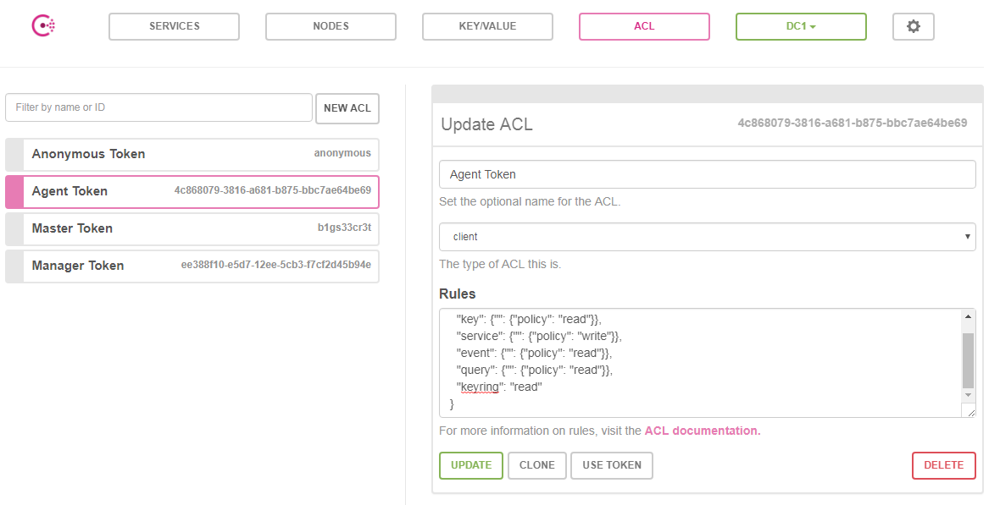

### Consul ACLs 配置使用

##### 设置root token

对数据中心的每个consul server，配置acl：

```
!# consul server config file: /etc/consul/acl_master.json
{
  "acl_datacenter":"dc1",
  "acl_master_token":"zqroot_qazxsw",
  "acl_default_policy":"deny",
  ...
  //consul 其他配置参数(见master.json)，正式使用时，需删除注释
}
//重启consul server
consul agent -config-file=/etc/consul/acl_master.json -config-dir=/etc/consul/conf -rejoin 
```

- acl_default_policy 默认值是allow，即能够执行任何操作，这里需要关闭。
- acl_master_token 需要在每个consul上配置，有management级别的权限，相当于一个种子token。
- acl_datacenter 区域的标识。

##### 创建management token

通过Api接口 /v1/acl/create 创建一个management token，生成时需要上文配置的master token。

```
curl --request PUT --header "X-Consul-Token:zqroot_qazxsw" --data '{"Name":"Manager Token","Type":"management","Rules":"node \"\" {policy=\"write\"} service \"\" {policy=\"write\"} key \"\" {policy=\"write\"}"}' http://127.0.0.1:8500/v1/acl/create

//返回的id为需要的token
{"ID":"ee388f10-e5d7-12ee-5cb3-f7cf2d45b94e"}
```
##### 设置management token

将这个management token配置在所有的consul 上，便于管理ACL、KV、service等。

```
!# consul server config file: /etc/consul/acl_master.json
{
  "acl_datacenter":"dc1",
  "acl_master_token":"zqroot_qazxsw",
  "acl_token":"ee388f10-e5d7-12ee-5cb3-f7cf2d45b94e",//menagement token
  "acl_default_policy":"deny",
  ...
  //consul 其他配置参数(见master.json)，正式使用时，需删除注释
}
//重启consul server
consul agent -config-file=/etc/consul/acl_master.json -config-dir=/etc/consul/conf -rejoin 
```

```
!# consul client config file: /etc/consul/acl_client.json
{
  "acl_datacenter":"dc1",
  "acl_token":"ee388f10-e5d7-12ee-5cb3-f7cf2d45b94e",//menagement token
  ...
  //consul 其他配置参数(见client.json)，正式使用时，需删除注释
}
//重启consul client
consul agent -config-file=/etc/consul/acl_client.json -config-dir=/etc/consul/conf -join 10.62.62.25
```

##### 创建agent token

通过Api接口 /v1/acl/create 创建一个agent token，生成时需要上文配置的master token。Type为client

```
curl --request PUT --header "X-Consul-Token:zqroot_qazxsw" --data '{"Name":"Agent Token","Type":"client","Rules":"key \"\" {policy=\"read\"} service \"\" {policy=\"write\"} event \"\" {policy=\"read\"} query \"\" {policy=\"read\"} "}' http://127.0.0.1:8500/v1/acl/create

//返回的id为需要的token
{"ID":"4c868079-3816-a681-b875-bbc7ae64be69"}
```

也可以通过UI界面，对ACL操作管理和更新策略(在设置management token之前，无法进入ui管理acl)



##### 使用agent token

AppServer 开发时，需要带上Agent Token，默认为Anonymous Token。

```
const defaultToken = "anonymous"
func makeInst(uriStr string, token string) (*ConsulAgent, error) {
	if len(uriStr) == 0 {
		uriStr = "http://127.0.0.1:8500"
	}

	uri, err := url.Parse(uriStr)
	if err != nil {
		logs.Error("url parse error: ", err)
		return nil, err
	}
	config := consulapi.DefaultConfig()
	config.Address = uriStr
	if len(token) > 0 {
		config.Token = token
	} else {
		config.Token = defaultToken
	}
	client, err := consulapi.NewClient(config)
	if err != nil {
		logs.Error("consul: ", uri.Scheme)
		return nil, err
	}
	agent := &ConsulAgent{client: client}
	return agent, nil
}
```

